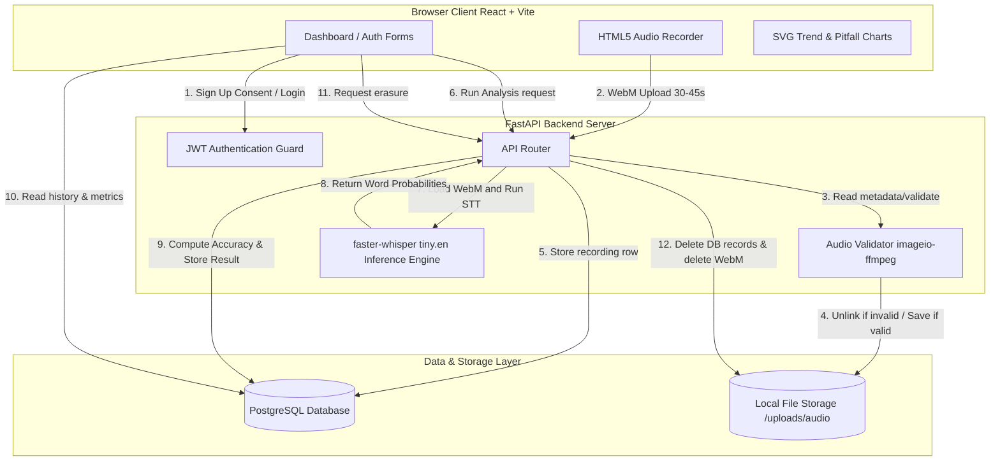

# System Architecture Doc: PronounceAI

PronounceAI is an AI-powered English pronunciation evaluation platform. This document outlines the component architecture, technology stack, scoring methodology, and data compliance posture in detail.

---

## 1. Component Connection Architecture

Below is the logical system architecture detailing how the frontend and backend communicate, interact with storage, and connect to the local inference engine.

### Components Summary:
1. **Frontend (React + TypeScript + Vite)**: Renders a modern SPA. Includes microphone recording (via HTML5 MediaRecorder API, restricted to WebM output) and customized interactive SVG charts mapping pronunciation scores and pitfalls without bloating dependencies.
2. **Backend (FastAPI)**: Serves high-performance endpoints. Coordinates JWT session validation, ffmpeg duration analysis, file operations, and AI inference.
3. **Database (PostgreSQL)**: Stores user identities, recording metadata, and evaluation results.
4. **AI Inference (faster-whisper tiny.en)**: Runs locally on the server CPU. Translates speech to word-level timestamps and confidence intervals.

---

## 2. Model & API Selection Rationale

For the speech-to-text (STT) and pronunciation scoring foundation, we selected the **faster-whisper tiny.en** model running local CPU inference over alternative approaches (e.g., OpenAI API, Whisper API, Azure Speech API).

### Comparison Matrix:
| Criterion | Local `faster-whisper` (Selected) | Cloud APIs (Azure/OpenAI) |
| :--- | :--- | :--- |
| **Data Privacy (DPDP)** | **Highest** (Data never leaves the server boundary) | **Medium** (Subject to third-party data processing) |
| **Cost** | **Zero** (Self-hosted CPU/GPU resources) | **Variable** (Pay-per-minute/token pricing) |
| **Latency** | **Low/Predictable** (Local socket execution) | **High** (Network round-trips + queuing delay) |
| **Word-Level Data** | **Excellent** (Native confidence probabilities) | **Medium** (Varies by provider, sometimes custom schemas) |

### Why `tiny.en`?
For an MVP deployed on modest CPU servers, `tiny.en` strikes the perfect balance:
- **Low Overhead**: Extremely lightweight memory footprint (~100 MB RAM) running using integer 8 (`int8`) quantization.
- **Precision**: Fine-tuned exclusively for English, offering high transcription speed.
- **Granular Data**: Supplies confidence weights for individual words, which is essential for highlighting mistakes.

---

## 3. Pronunciation Scoring & Highlight Logic

Pronunciation scoring uses **acoustic model confidence mapping**:

1. **Inference Stage**: The audio file is passed to `WhisperModel.transcribe()` with `word_timestamps=True`.
2. **Confidence Extraction**: Whisper returns each detected word accompanied by an acoustic probability score $P(\text{word}) \in [0.0, 1.0]$.
3. **Thresholding (Pronunciation Score)**:
   - Words with $P(\text{word}) \ge 0.70$ are classified as **Correct** (rendered in green in the UI).
   - Words with $P(\text{word}) < 0.70$ are flagged as **Unclear or Mispronounced** (rendered in red).
4. **Feedback Generation**: For flagged words, the system isolates the token and builds custom improvement suggestions:
   $$\text{Accuracy Score} = \left( \frac{\sum_{i=1}^{N} P(\text{word}_i)}{N} \right) \times 100$$
5. **UI Rendering**: The transcript is displayed. Hovering over a red word reveals the underlying Whisper probability as a percentage, alongside a tip to slow down and emphasize syllables.

---

## 4. DPDP Compliance Posture (India DPDP Act 2023)

We built the application with **Privacy by Design** to strictly comply with India's Digital Personal Data Protection Act 2023:

- **Explicit Notice & Consent (Section 6)**: During registration, users are presented with a clear notice detailing what data is stored (email, password hash, voice recordings) and how it is processed. Sign-up is blocked unless the user checks the consent box.
- **Right to Erasure / Deletion (Section 12)**:
  - **Individual Records**: Users can delete any audio recording from their history. The backend deletes the database row and triggers `unlink` to physically wipe the file from server disk storage.
  - **Account Deletion**: Users can permanently erase their profile. The server sweeps through all user recordings, unlinks their files from disk, and drops the user DB row. Database constraints cascade and clean up all associated evaluation entries.
- **Data Residency**: The PostgreSQL database and physical audio store are localized on secure host servers, complying with local Indian storage rules.
- **No Shared Processing**: Audio files are processed locally on the secure server using the self-hosted Whisper model. Data is never shared with third-party generative AI models.

---

## 5. Technical Trade-offs & Future Roadmap

### Trade-offs Made:
1. **CPU Local Inference vs. GPU Acceleration**: We host inference on the CPU using `ctranslate2` backend optimizations. This limits the scale of parallel requests but minimizes deployment costs.
2. **WebM Formats**: We rely on client-side browser encoding producing lightweight WebM files, saving bandwidth, with ffmpeg parsing the headers on the backend.
3. **Acoustic Probability vs. Phoneme Comparison (G2P)**: We use Whisper's confidence rating rather than complex IPA/phoneme level alignments. This yields rapid, intuitive suggestions but does not target phonetic details.

### If We Had Another Week, We Would Build:
1. **Phoneme-Level Alignment (Grapheme-to-Phoneme)**: Implement a G2P system (like Kaldi or Wav2Vec2) to identify the exact phoneme error (e.g., mispronouncing /θ/ as /t/).
2. **Interactive Audio Playback**: Save word-level timestamps in the database, allowing users to click a mispronounced word to listen to that exact slice of their recording, alongside a text-to-speech reference.
3. **Automatic Data Retention Sweep**: Implement a cron worker that deletes files automatically after 30 days of inactivity to enforce minimal storage duration under DPDP.
4. **GPU-Backed Queue**: Move inference to a Celery worker queue backed by Redis and a CUDA-capable GPU node to support scale.
